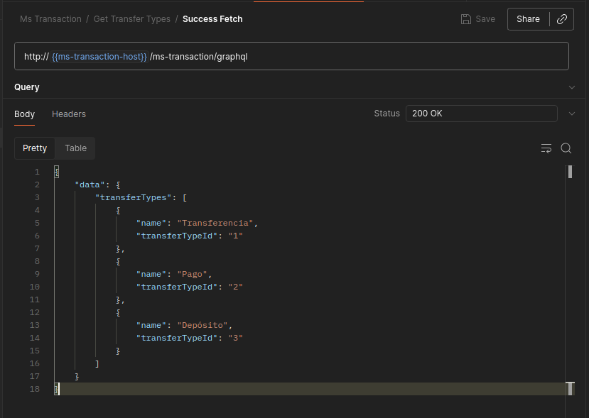
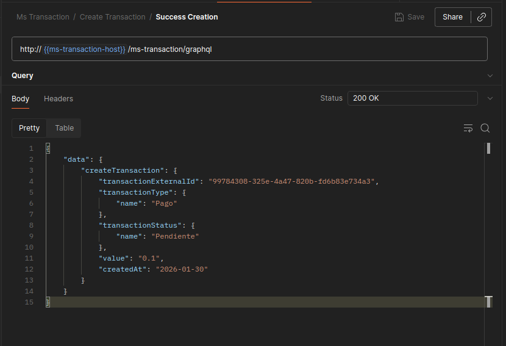
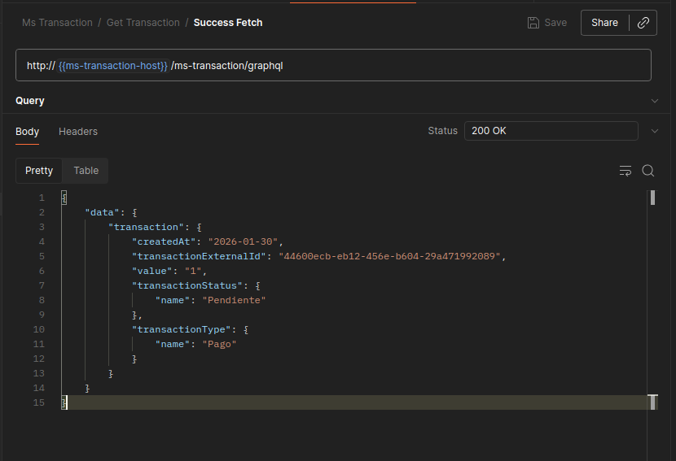

# Yape Code Challenge - Enterprise Solution :rocket:

[](https://www.postman.com/me-juda-carrillo/yape-code-challenge/)

## Table of Contents

- [Overview](#overview)
- [Solution Architecture](#solution-architecture)
- [Problem Resolution](#problem-resolution)
- [Why Quarkus?](#why-quarkus)
- [Enterprise Features](#enterprise-features)
- [Technical Stack](#technical-stack)
- [Getting Started](#getting-started)
- [API Usage](#api-usage)
- [Testing](#testing)

---

## Overview

This solution implements a **production-ready microservices architecture** for the Yape Code Challenge, demonstrating how a fintech company would build a scalable transaction processing system.

**Key Highlights:**
- Event-Driven Architecture with Apache Kafka & Avro
- GraphQL API (instead of REST)
- Clean Architecture + CQRS Pattern
- Multi-layer Caching with Redis
- 94% Test Coverage

---

## Solution Architecture

```
┌─────────────────────────────────────────────────────────────────────────────┐
│                              CLIENT (GraphQL)                                │
└─────────────────────────────────────────────────────────────────────────────┘
                                      │
                                      ▼
┌─────────────────────────────────────────────────────────────────────────────┐
│                         MS-TRANSACTION (:18080)                              │
│  GraphQL → Use Cases → Domain Services → [PostgreSQL, Redis, Kafka]         │
└─────────────────────────────────────────────────────────────────────────────┘
                                      │
              ┌───────────────────────┴───────────────────────┐
              │ transaction.created        transaction.status │
              ▼                                               ▲
┌─────────────────────────────────────────────────────────────────────────────┐
│                          MS-ANTI-FRAUD (:18081)                              │
│     Kafka Consumer → Validation Service → Kafka Producer                     │
│                    (Reject if value > 1000)                                  │
└─────────────────────────────────────────────────────────────────────────────┘

┌─────────────────────────────────────────────────────────────────────────────┐
│  PostgreSQL:5432 │ Redis:6379 │ Kafka:9092 │ Schema Registry:8081           │
└─────────────────────────────────────────────────────────────────────────────┘
```

---

## Problem Resolution

| Requirement | Implementation |
|-------------|---------------|
| Create transaction with pending status | ✅ GraphQL mutation saves with `PENDING` status |
| Anti-fraud validation via messaging | ✅ Kafka event to `transaction.created` topic |
| Reject transactions > 1000 | ✅ `AntiFraudValidationService` validates threshold |
| Update status via messaging | ✅ Response via `transaction.status` topic |
| High-volume support | ✅ Redis caching + Kafka async processing |

---

## Why Quarkus?

| Metric | Spring Boot | Quarkus JVM | Quarkus Native |
|--------|-------------|-------------|----------------|
| Startup Time | ~3-5s | ~0.8s | ~15ms |
| Memory (RSS) | ~300MB | ~150MB | ~35MB |
| Docker Image | ~300MB | ~200MB | ~70MB |

**Enterprise Benefits:**
- **Cloud-Native**: Built for Kubernetes & containers
- **Native Compilation**: GraalVM support for serverless
- **Reactive**: Non-blocking Kafka processing
- **Developer Experience**: Live reload with `quarkus:dev`
- **Standards**: MicroProfile, Jakarta EE, Vert.x

---

## Enterprise Features

### Clean Architecture
```
src/main/java/com/yape/services/
├── expose/graphql/         # GraphQL Resolvers
├── transaction/
│   ├── application/        # Use Cases, Commands, Queries
│   ├── domain/             # Models, Repository Interfaces
│   └── infrastructure/     # PostgreSQL, Redis, Kafka
└── shared/exception/       # Error Handling
```

### Event-Driven with Avro Schemas
- Schema evolution with Confluent Schema Registry
- Type-safe serialization
- Request traceability via `requestId`

### Caching Strategy
| Status | TTL | Rationale |
|--------|-----|-----------|
| PENDING | 5 min | Status will change |
| APPROVED/REJECTED | 1 hour | Final state |

---

## Technical Stack

| Component | Technology | Version |
|-----------|------------|---------|
| Framework | Quarkus | 3.31.1 |
| Language | Java | 21 |
| API | SmallRye GraphQL | - |
| Database | PostgreSQL | 14 |
| Cache | Redis | 8 |
| Messaging | Kafka + Avro | 7.9.0 |
| ORM | Hibernate Panache | - |
| Migrations | Flyway | - |

---

## Getting Started

### 1. Start Infrastructure
```bash
docker-compose up -d
```

### 2. Run Microservices
```bash
# Terminal 1 - Transaction Service
cd ms-transaction && ./mvnw quarkus:dev

# Terminal 2 - Anti-Fraud Service  
cd ms-anti-fraud && ./mvnw quarkus:dev
```

### 3. Verify Health
```bash
curl http://localhost:18080/ms-transaction/health
curl http://localhost:18081/ms-anti-fraud/health
```

---

## API Usage

### Step 1: Fetch Transfer Types

```graphql
query {
  transferTypes {
    transferTypeId
    name
  }
}
```



---

### Step 2: Create Transaction

```graphql
mutation {
  createTransaction(input: {
    accountExternalIdDebit: "550e8400-e29b-41d4-a716-446655440000"
    accountExternalIdCredit: "550e8400-e29b-41d4-a716-446655440001"
    transferTypeId: 1
    value: "500.00"
  }) {
    transactionExternalId
    transactionStatus { name }
    value
    createdAt
  }
}
```



---

### Step 3: Fetch Transaction

```graphql
query {
  transaction(transactionExternalId: "YOUR_TRANSACTION_ID") {
    transactionExternalId
    transactionType { name }
    transactionStatus { name }
    value
    createdAt
  }
}
```



---

## Testing

### Run Tests
```bash
cd ms-transaction && ./mvnw test
cd ms-anti-fraud && ./mvnw test
```

### Coverage Report
```bash
./mvnw verify
# Report: target/site/jacoco/index.html
```

**ms-transaction: 94% coverage**

| Package | Coverage |
|---------|----------|
| application.usecase | 94% |
| application.query | 100% |
| infrastructure.cache | 100% |
| infrastructure.messaging | 100% |

---

## Author

**Juda Carrillo** - Tech Lead | Senior Backend Developer  
📧 [jbcp2006@gmail.com](mailto:jbcp2006@gmail.com)
